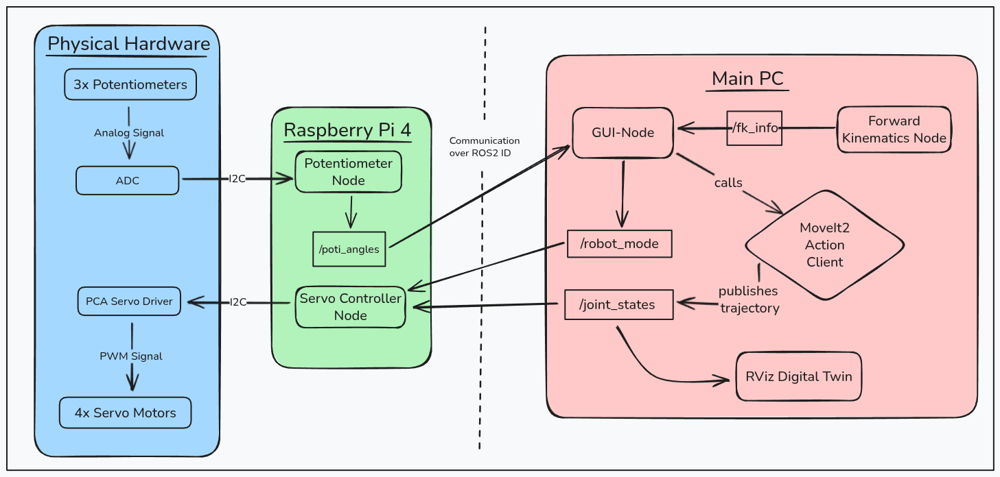
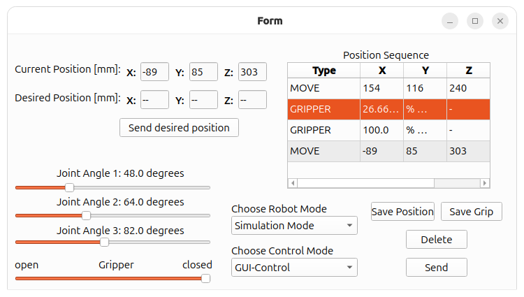
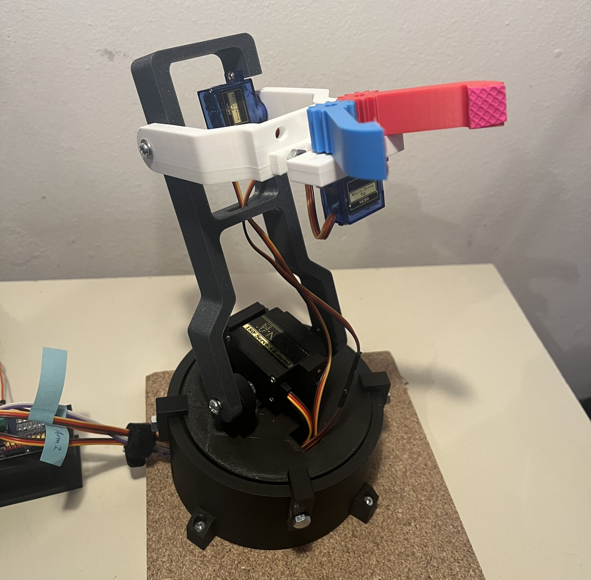
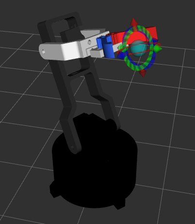
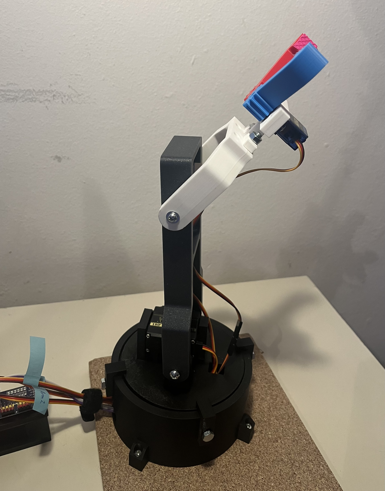
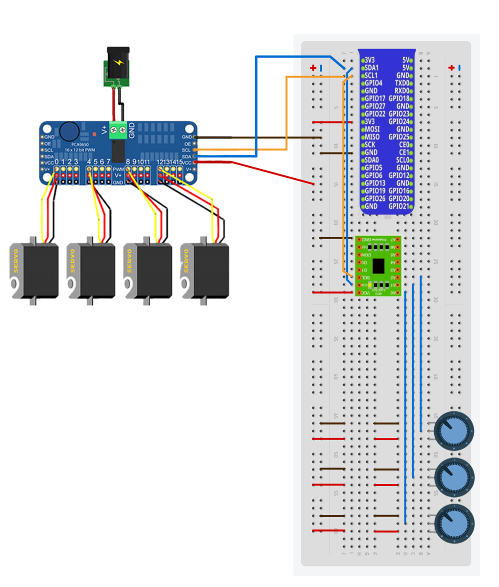
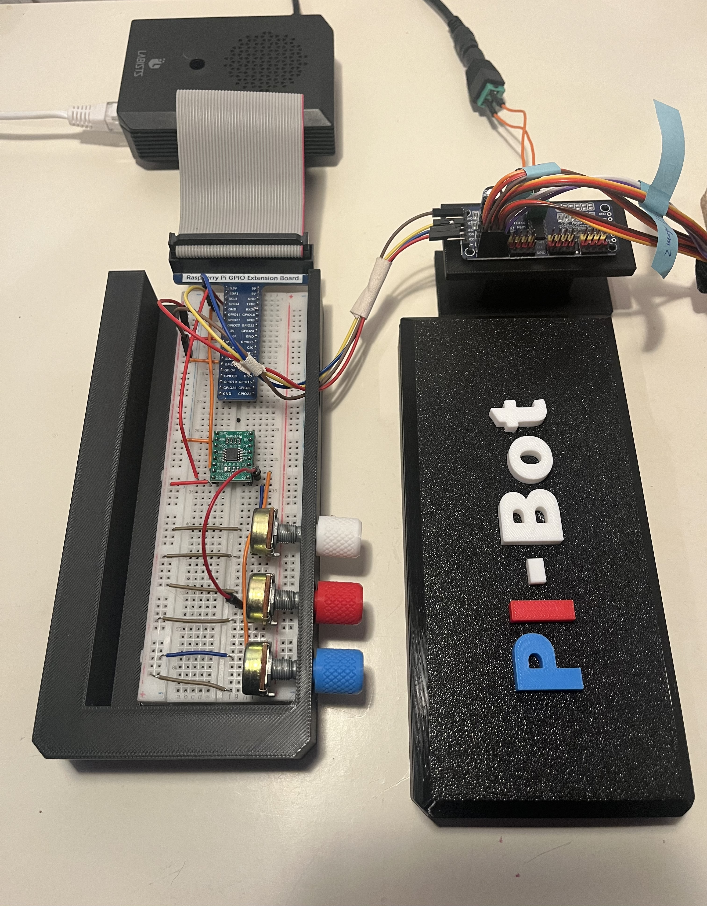
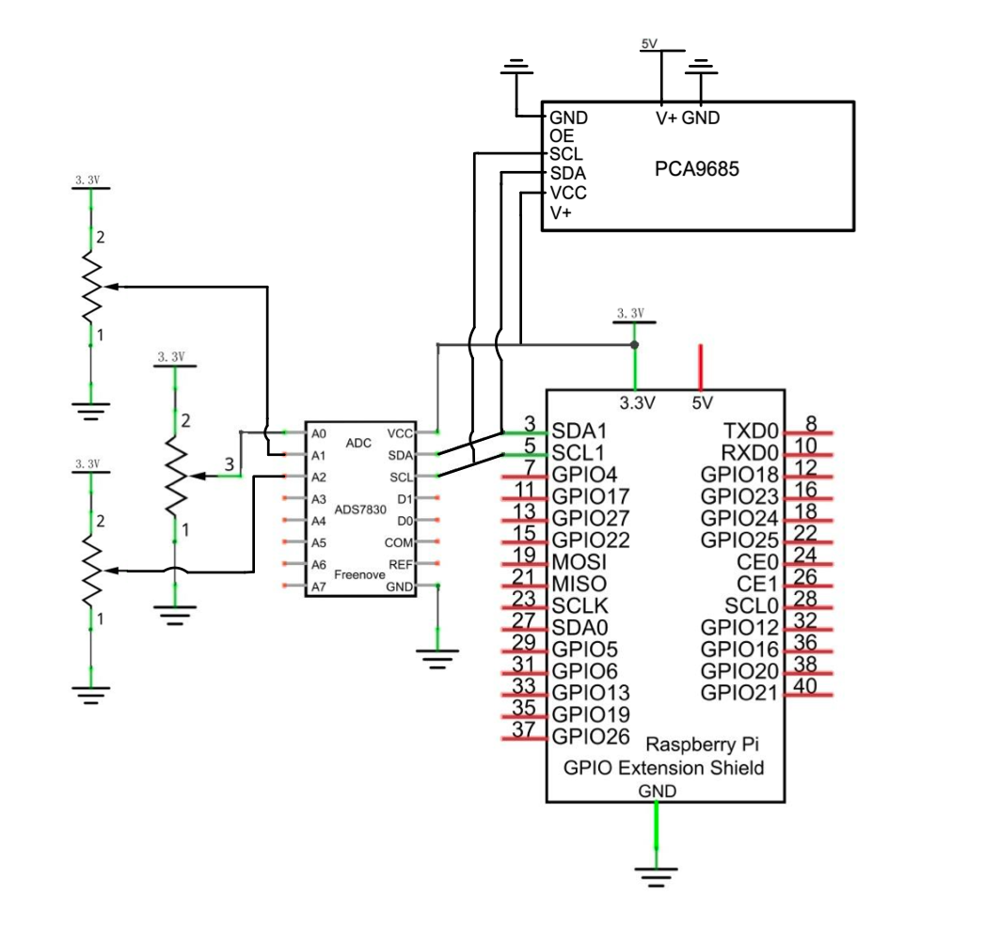

# PI-Bot: Distributed 3-DOF Robotic Arm

## Table of Contents
1. [Project Overview & Demo](#1-project-overview--demo)
2. [System Architecture](#2-system-architecture)
3. [Key Features](#3-key-features)
4. [PI-Bot control center (GUI)](#4-gui)
5. [Digital Twin](#5-digital-twin)
6. [Hardware & Wiring](#6-hardware--wiring)
7. [Quick start](#7-quick--start)
8. [Challenges & Solutions](#8-challenges)

## Project Structure 

```text
robotic_arm_project/
├── docs/           
├── src/   
├──── move_it_services/         # Custom Srv/Msg definitions (e.g. MoveToXYZ)
├──── my_robot_interfaces/      # Custom interfaces used in multiple nodes
├──── pca9685_servo_controller/ # Control the physical servos 
├──── potentiometer_reader/     # Read out potentiometer values
├──── robot_controller/         # MoveIt2 controller config
├──── robot_description/        # URDF & meshes
├──── robot_fk/                 # Forward kinematic calculations
├──── robot_gui/                # Pibot GUI
├──── robot_moveit/             # MoveIt2 configuration & SRDF
└── README.md                   # Documentation
```

## 1. Project Overview & Demo <a name="1-project-overview--demo"></a>

### Demo

*The PI-Bot autonomously performing a pick-and-place task, synchronized with its Digital Twin in RViz.*

### About the Project
The **PI-Bot** is a custom-engineered, 3D printed, 3-DOF robotic arm designed as a full-stack robotics project. It demonstrates the seamless integration of distributed software systems, real-time hardware interaction, and motion planning. 

The project covers:
*   **Mechanical Design in CAD:** 3-axis manipulator with gripper.
*   **Embedded Control:** Custom ROS2 nodes on a Raspberry Pi 4 for PWM actuation and ADC sensor readout.
*   **Advanced Middleware:** MoveIt2 for path planning and a synchronized Digital Twin.
*   **UI:** A PySide6/Qt GUI for orchestration.

---


## 2. System Architecture <a name="2-system-architecture"></a>

The PI-Bot is built on a **distributed ROS2 architecture**, separating high-level logic from hardware-near execution to ensure modularity and system stability.


*High-level overview of the distributed control loop and node communication.*

### Main PC (High-Level Logic)
The workstation acts as the "Brain" of the system, running computationally intensive nodes:
*   **GUI-Node (PySide6):** The central hub for user interaction. It subscribes to `/poti_angles` for manual input and `/fk_info` for real-time monitoring of the end-effector position. It orchestrates movements by calling the MoveIt2 Action Client and controls if the robot is in hardware or simulation mode.
*   **MoveIt2 Action Client:** Handles trajectory planning and inverse kinematics (IK). Once a path is planned, it publishes the trajectory points to the `/joint_states` topic.
*   **Forward Kinematics Node:** A dedicated node that processes joint angles to calculate the end-effector's XYZ position, providing feedback to the GUI.
*   **RViz Digital Twin:** Subscribes to `/joint_states` to provide a real-time 3D visualization of the robot's physical state.

### Raspberry Pi 4 (Hardware Abstraction Layer)
The Pi 4 serves as the bridge between the digital ROS2 environment and the physical hardware:
*   **Potentiometer Node:** Interfaces with the **ADS7830 ADC** via **I2C**. It reads analog signals from the three potentiometers, processes them, and publishes the values to the `/poti_angles` topic.
*   **Servo Controller Node:** Subscribes to the `/joint_states` and `/robot_mode` topics from the main PC and converts these states into **I2C** commands for the **PCA9685 Servo Driver**. When the robot is in hardware mode, the driver generates PWM signals to control the four servo motors.

### Communication Layer
*   **ROS2 Middleware:** All communication between the PC and the Raspberry Pi is handled over the local network using a shared **ROS_DOMAIN_ID**.
---

## 3. Key Features <a name="3-key-features"></a>

*   **Multi-Modal Hybrid Control:** The PI-Bot offers four distinct ways to interact with the hardware:
    *   **Joint-Space Control:** Precise manipulation of individual axes via interactive GUI sliders (0-180°).
    *   **Cartesian-Space Control:** Users can input target **XYZ-coordinates** (in mm). The system calls a custom `MoveToXYZ` service to plan and execute the motion.
    *   **Hardware-in-the-Loop (HIL):** Real-time physical **analog potentiometers** for intuitive manual positioning.
    *   **Interactive Planning (MoveIt2):** Full integration with RViz, allowing users to move the robot via **Drag & Drop (Interactive Markers)**. 

*   **Real-time State Sync:** The `sync_sliders_to_movement` logic continuously updates the GUI sliders to always match the actual hardware state, preventing jumps when switching control modes.
*   **Teach-In Sequence Recorder:** Store specific positions of the end-effector, or gripper in a table and execute them as a complex motion sequence.

*   **Asynchronous Processing:** Multi-threaded Python/Qt implementation to keep the UI responsive during long-running trajectory executions and service/action calls.

---
## 4. PI-Bot Control Center (GUI) <a name="4-gui"></a>

The **PI-Bot Control Center** is a PySide6 (Qt)-based HMI providing centralized control, state monitoring, motion teaching, and direct servo manipulation via sliders.


Figure: The PI-Bot Control Center showing a programmed stacking sequence.

## Core Interface Components

### Cartesian Monitoring & IK Control (Top Left)
- **Live Feedback:** Displays the end-effector’s real-time XYZ coordinates (mm), computed by the Forward Kinematics (FK) node.  
- **Target Input:** Users can enter desired Cartesian coordinates. Clicking **“Send desired position”** invokes MoveIt2 Inverse Kinematics (IK) to plan and execute the motion.

### Joint-Space Manipulation (Bottom Left)
- **Interactive Sliders:** Direct control of all three joints and the gripper.  
- **Bi-directional Sync:** Sliders continuously reflect the robot’s physical state, including movements from external potentiometers or RViz interactive markers.

### Teach-In Panel (Right)
- **Sequence Recorder:**  
  - **“Save Position”** stores the current spatial pose.  
  - **“Save Grip”** stores the current gripper state.  
- **Automation Workflow:**  
  - The table holds command types:  
    - `MOVE` → spatial target  
    - `GRIPPER` → aperture state  
- **Configuration:**  
  - Pressing **Delete** removes the currently selected (orange-highlighted) row.
- **Execution:**  
  - Pressing **“Send”** runs the sequence from top to bottom, enabling autonomous repetitive tasks (e.g., stacking or sorting).


### System Mode Management (Bottom Center)
- **Robot Mode:**  
  - **Simulation Mode** → Digital twin visualization  
  - **Hardware Mode** → Physical servo actuation  
- **Control Mode:**  
  - **GUI Control**  
  - **Potentiometer Control (Hardware-in-the-Loop)**
---
## 5. Digital Twin <a name="5-digital-twin"></a>

A core feature of the PI-Bot is the implementation of a **Digital Twin**. This virtual mirror ensures that every movement of the physical hardware is precisely reflected in the simulation environment (RViz) and vice versa.

<p align="center">
  
  
  <br>
  <em>Figure: Comparison between the physical 3-DOF arm (left) and its synchronized Digital Twin in RViz (right).</em>
</p>

<p align="center">
  
  
  <br>
  <em>Figure: Comparison between the physical 3-DOF arm (left) and its synchronized Digital Twin in RViz (right).</em>
</p>

### Physical-to-Digital Synchronization

*   **URDF & Mesh Integration:** The robot is defined via a custom **Unified Robot Description Format (URDF)**, using precise meshes from my own CAD Design and joint limits derived from the Moveit config.
*   **State Mirroring:** By subscribing to the `/joint_states` topic, the `robot_state_publisher` updates the **TF-tree** in real-time.
*   **Safety & Planning:** Before any physical movement occurs, MoveIt2 uses the Digital Twin to perform **collision checking** and trajectory validation, ensuring safe operation in the physical workspace.
*   **Remote Monitoring:** Through the distributed architecture, the Digital Twin allows for full remote monitoring of the robot's status over the network without needing a direct line of sight to the hardware.
---
## 6. Hardware & Wiring <a name="6-hardware--wiring"></a>

### Used Components:
| Component | Quantity | Interface | Description |
| :--- | :---: | :--- | :--- |
| **Raspberry Pi 4 (4GB)** | 1 | Network/I2C | Main distributed controller node |
| **ADS7830 ADC** | 1 | I2C (0x48) | 8-channel 8-bit ADC for potentiometer readout |
| **PCA9685 Driver** | 1 | I2C (0x40) | 16-channel PWM controller for servos |
| **MZ996 Servos** | 2 | PWM | High-torque servos for the base and the first arm|
| **9G Micro Servo** | 2 | PWM | Lightweight servo for the gripper mechanism and upper arm|
| **Potentiometers** | 3 | Analog | 10k Ohm linear pots for HIL control |
| **Power Supply** | 1 | DC | External 5V/10A supply for Servo Driver |


### Wiring Diagram

<p align="left">
  
  <br>
  <em>Figure: Visual wiring overview.</em>
</p>

### Real-Life Implementation

<p align="left">
  
  <br>
  <em>Figure: Physical hardware setup.</em>
</p>

### Schematic Diagram
<p align="left">
  
  <br>
  <em>Figure: Visual wiring schematic.</em>
</p>


### Implementation Details

*   **I2C Bus Management:** Both the **ADS7830** (ADC) and the **PCA9685** (PWM Driver) share the same I2C bus using unique hardware addresses (`0x48` and `0x40`). This keeps the wiring simple and modular.
*   **External Power Architecture:** The Raspberry Pi alone cannot provide enough current for four servos, especially during high-torque startup. I implemented an **external 5V/4A power supply** connected via the **PCA9685's power terminal**
*   **Sensor Precision:** The **ADS7830** provides 8-bit resolution (0–255). Mapping 255 steps to the 180° range of the servos results in a precision of **~0.7° per step**, which is more than sufficient for smooth manual manipulation via potentiometers.
*   **Signal Integrity & Motion Smoothing:** To mitigate signal noise and prevent mechanical jitter, I implemented an **Exponential Smoothing Filter (Low-pass)** within the Servo Controller node. This ensures fluid joint transitions and protects the hardware from abrupt accelerations.

## 7. Quick Start <a name="7-quick--start"></a>

This project is developed and tested on **Ubuntu 24.04 (Noble Numbat)**.

- **Control Station (PC)** – Runs GUI, MoveIt 2, and the Digital Twin in RViz  
- **Robot Hardware (Raspberry Pi)** – Reading of the Potentiometers & controlling the servos


### Dependencies & Requirements 

- **OS:** Ubuntu 24.04 (Noble Numbat)
- **ROS 2 Jazzy:** Installed -> https://docs.ros.org/en/jazzy/Installation.html
- **Network:**  
  - Both devices must be in the **same network**  
  - `ROS_DOMAIN_ID` must **match on both machines**

Before building the project, ensure rosdep is initialized and updated: 
```bash
sudo rosdep init
rosdep update
```

### Main PC (GUI & Simulation)
The main PC can operate independently, allowing you to run the GUI, RViz, and MoveIt without connecting to the physical robot.
In this mode, no hardware interaction is available, but the robot model in RViz can still be fully controlled through the GUI and MoveIt for simulation and testing.

**1. Clone the repository**
```bash
git clone https://github.com/BrenzingerLuca/robotic_arm_project.git
cd robotic_arm_project
```
**2. Install dependencies**
```bash
# Install Python requirements
pip install -r requirements.txt --break-system-packages

# Install ROS 2 dependencies
rosdep install --from-paths src --ignore-src -r -y
```
**3. Build and Source**
```bash
# Build the workspace
colcon build --symlink-install

# Source the workspace
source /opt/ros/jazzy/setup.bash
source install/setup.bash
```

**4. Launch**
```bash
ros2 launch robot_gui pibot_gui.launch.py
```
After launching, the robot displayed in RViz can be controlled using the GUI and MoveIt, enabling motion planning and visualization without requiring the physical hardware.

### Raspberri Pi (Hardware Controller)
This step is only required if the necessary hardware is available.
However, for completeness, the full startup procedure is documented below.

The steps are the same as for the Main-PC but the launch file is different.

**Launch**
```bash
ros2 launch pca9685_servo_controller raspi.launch.py
```

These packages provide access to the I²C bus (smbus2) and the PCA9685 PWM controller used for driving the servos.

**Note:** for  this to work the I2C-Bus has to be activated and needs to be accessible.

---
## 8. Challenges & Solutions <a name="8-challenges"></a>

Building the **PI-Bot** as a solo project involved several technical hurdles. Below are the key challenges encountered during development and the engineering decisions made to resolve them:

### Servo Jitter & System Stability
*   **Challenge:** Initial tests showed significant servo jitter and occasional system resets when moving multiple joints simultaneously.
*   **Solution:** 
    *   **Hardware:** Offloaded PWM generation to a dedicated **PCA9685 controller** to ensure stable timing independent of the Raspberry Pi's CPU load.
    *   **Power:** Implemented a separate **external 5V/4A power rail** for the servos to prevent voltage drops on the Pi's logic board during high-torque movements.
    *   **Software:** Integrated an **Exponential Smoothing filter** (digital low-pass) in the `ServoController` node to clean up noisy analog signals from the potentiometers.

### Seamless Control Mode Transitions
*   **Challenge:** When switching back to GUI control after using the physical potentiometers or running an automated sequence, the robot would "jump" abruptly to the last stored slider position.
*   **Solution:** Developed the `sync_sliders_to_movement` logic. This function continuously synchronizes the GUI slider positions with the actual hardware joint states. This ensures a **seamless handover** between different control modes, preventing sudden mechanical stress or dangerous movements.

### Responsive HMI (GUI) Integration
*   **Challenge:** ROS2 service calls and action goals are blocking by nature. Running them in the same thread as the GUI would cause the interface to freeze during trajectory planning or robot execution.
*   **Solution:** Integrated the ROS2 spin-loop **asynchronously** into the PySide6 event loop using a `QTimer`. By utilizing non-blocking **Action Clients** and `add_done_callback` functions, the GUI remains fully responsive and interactive while the PI-Bot is planning or executing complex trajectories.

---

