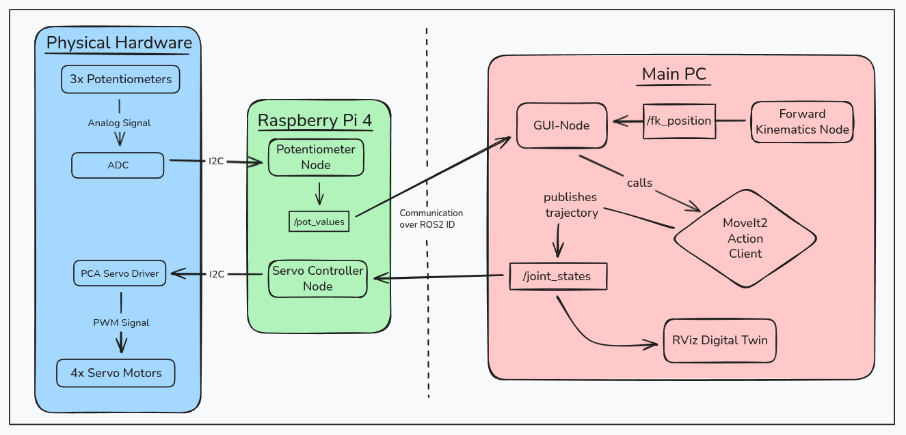

# PI-Bot: Distributed 3-DOF Robotic Arm

## Table of Contents
1. [Project Overview & Demo](#1-project-overview--demo)
2. [System Architecture](#2-system-architecture)
3. [Key Features](#3-key-features)
4. [Hardware & Wiring](#4-hardware--wiring)
5. [Project Structure](#5-project-structure)
6. [Kinematics & MoveIt2 Configuration](#6-kinematics--moveit2-configuration)
7. [Requirements & Installation](#7-requirements--installation)
8. [Getting Started](#8-getting-started)
9. [Troubleshooting](#9-troubleshooting)

---

## 1. Project Overview & Demo <a name="1-project-overview--demo"></a>

### Demo

*The PI-Bot autonomously performing a pick-and-place task, synchronized with its Digital Twin in RViz.*

### About the Project
The **PI-Bot** is a custom-engineered, 3D printed, 3-DOF robotic arm designed as a full-stack robotics project. It demonstrates the seamless integration of distributed software systems, real-time hardware interaction, and motion planning. 

The project covers:
*   **Mechanical Design in CAD:** 3-axis manipulator with gripper.
*   **Embedded Control:** Custom ROS2 nodes on a Raspberry Pi 4 for PWM actuation and ADC sensor readout.
*   **Advanced Middleware:** MoveIt2 for path planning and a synchronized Digital Twin.
*   **UI:** A professional PySide6/Qt GUI for orchestration.

---


## 2. System Architecture <a name="2-system-architecture"></a>

The PI-Bot utilizes a **distributed ROS2 architecture** to balance computational load and ensure low-latency hardware response:

*   **Workstation (Main PC):** Runs high-level nodes including MoveIt2, RViz, and the PySide6 GUI. It handles complex tasks like Inverse Kinematics (IK) and trajectory generation.
*   **Raspberry Pi 4 (Hardware Controller):** Serves as the Hardware Abstraction Layer (HAL). It runs dedicated nodes for the  and PCA9685 PWM (I2C) drivers.
*   **Communication:**



## 3. Key Features <a name="3-key-features"></a>

*   **Hybrid Control Modes:** Switch between GUI-Slider control and **Hardware-in-the-Loop (HIL)** control using analog potentiometers.
*   **Teach-In Sequence Recorder:** Store specific poses (Cartesian or Joint-space) in a table and execute them as a complex motion sequence.
*   **Real-time State Sync:** A specialized `sync_sliders_to_movement` logic ensures the GUI and Digital Twin always reflect the physical hardware state to prevent sudden jumps.
*   **Asynchronous Processing:** Multi-threaded Python/Qt implementation to keep the UI responsive during long-running trajectory executions.

---

## 4. Hardware & Wiring <a name="4-hardware--wiring"></a>

| Component | Interface | Description |
| :--- | :--- | :--- |
| **Raspberry Pi 4** | Ethernet/WiFi | Main Brain (Distributed Node) |
| **MCP3008** | SPI | 10-bit ADC for Potentiometer Feedback |
| **PCA9685** | I2C | 16-Channel PWM Driver for Servos |
| **MG996R / SG90** | PWM | Servo Actuators for Joints & Gripper |
| **Potentiometers** | Analog | Manual Input for HIL Control |

*(Optional: Add an image of your circuit diagram here)*

---

## 5. Project Structure 

```text
pi_bot/
├── robot_gui/           # PySide6 GUI Node & UI files
├── robot_description/   # URDF, Meshes, and Xacro files
├── robot_moveit_config/ # MoveIt2 configuration & SRDF
├── robot_hardware/      # Raspberry Pi Nodes (ADC/PWM drivers)
├── robot_interfaces/    # Custom Srv/Msg definitions (e.g. MoveToXYZ)
└── robot_bringup/       # Central Launch files
